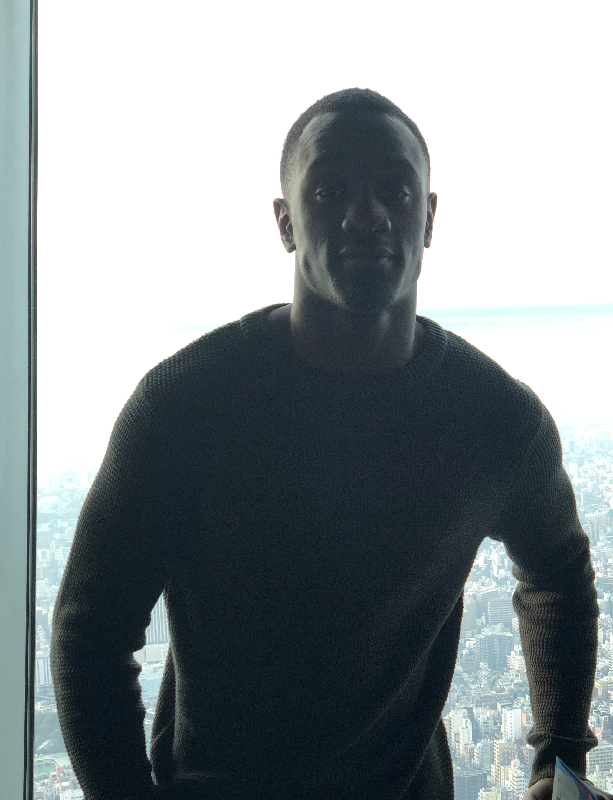
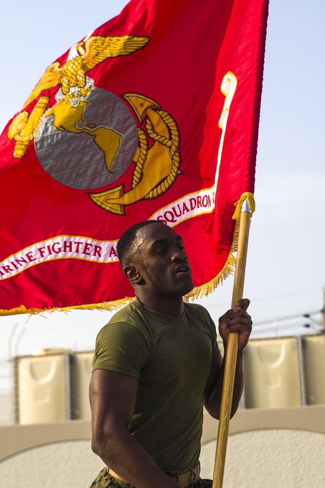

# This is my Bio
Born January 17th 1995 in Baltimore, MD. BiggMawk has been creating new begining for people since his early childhood days, being gifted with his heroic ability at the early age of 9. At the age of 16, BiggMawk's gift had evolved into a talent that has been acknowledged by his peers.

His style bounces back and forth between fluid decisiveness, and blending techniques such as Honor, Courage, and Commitment. Which is heavily influenced by the Code of Conduct.

He studies at University Maryland University College where in this time he hope to obtain a degree in english, so that he may become an officer in the Marine Corp. BiggMawk is currently on duty for his country aboard MCAS Iwakuni, Japan. 
# LOVING EVERY BIT :)
