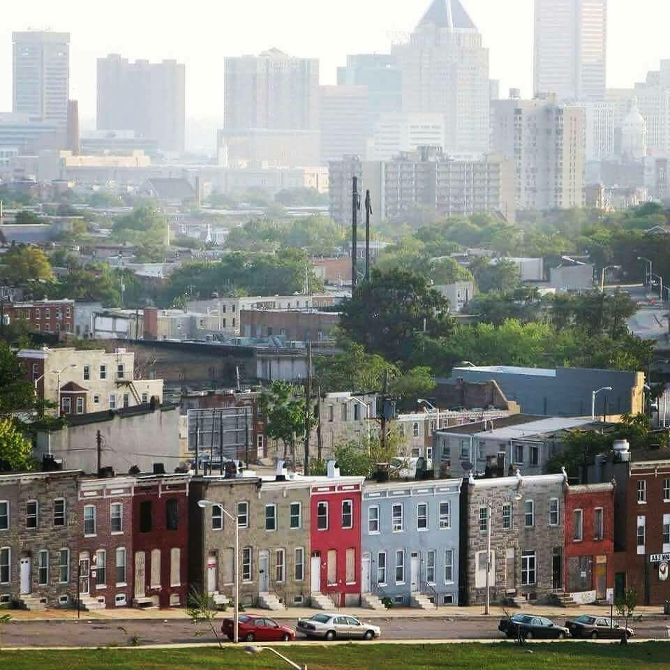
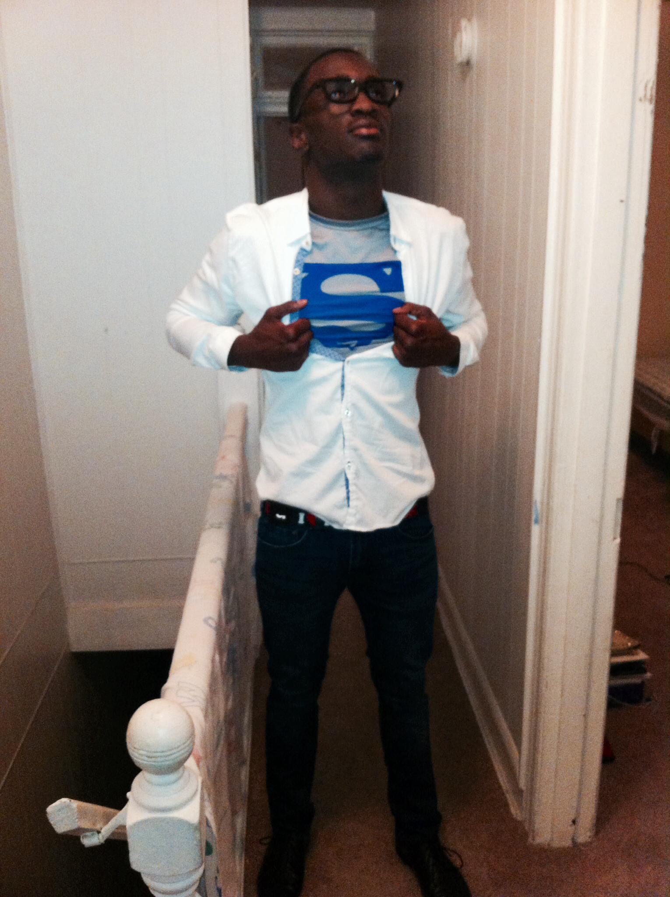

# The Confession

Back to *[home](https://biggmawk.github.io/ "Home")* page. link to *[bio](https://biggmawk.github.io/bio "bio")*.

Growing up I knew i wasn't the "NORMAL" kid... I was different. I had powers. Which I knew for as far as I can remember. Growing up in the City of Baltimore making it out isn't a guarantee. 

I had to grow fast. So I took advantage of the powers that I had, to no surprise. You either eat or be eaten! The decision wasn't hard. over time I've learned a lot. I got the chance to grow from mistakes and teach others. i became a hero...

soon after becoming aware of my true powers i wasted no time. i gathered a team and we sprong into action. This link will show you live footage <https://www.youtube.com/watch?v=1ltJqCPSA0o> 
# THE END!!!
Back to *[home](https://biggmawk.github.io/ "Home")* page. link to *[bio](https://biggmawk.github.io/bio "bio")*.
